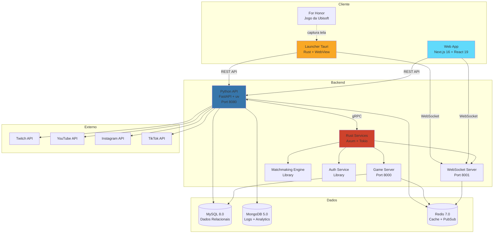
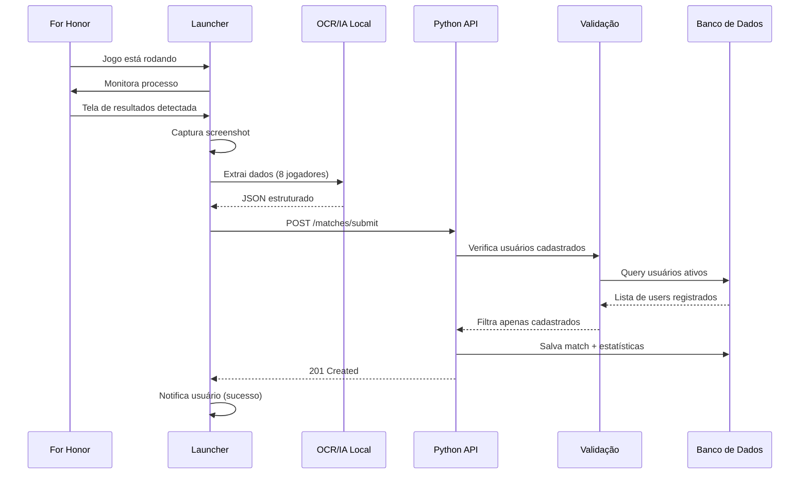
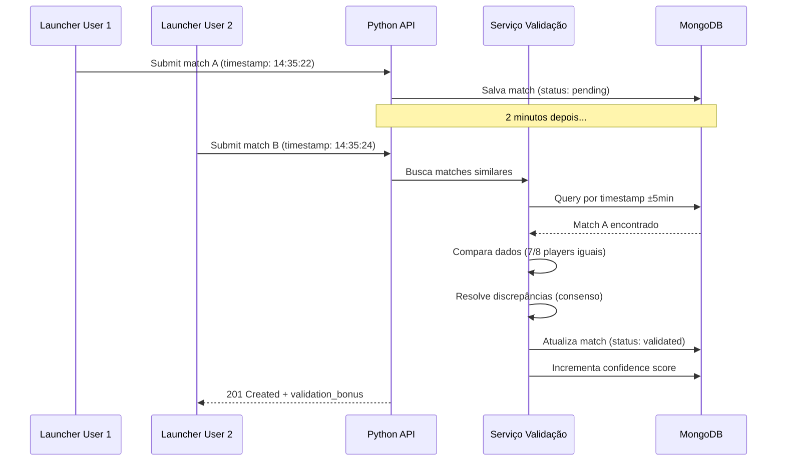
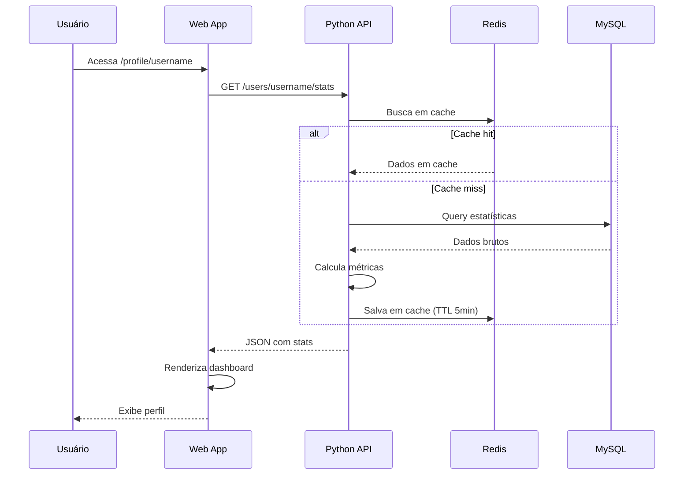
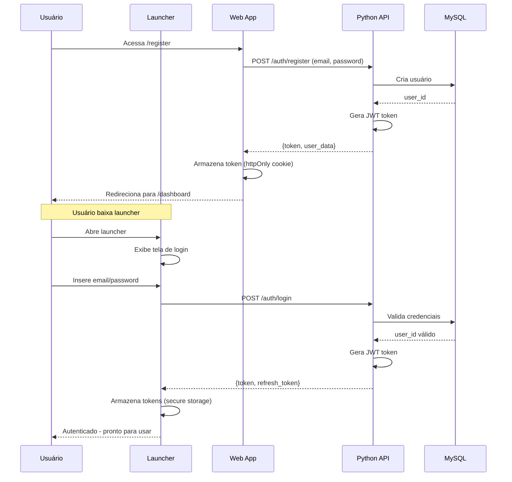

# 🏗️ Visão Geral da Arquitetura - RankedHonor

## 📐 Arquitetura de Alto Nível

RankedHonor utiliza uma arquitetura de **3 camadas** com componentes especializados para maximizar performance e manutenibilidade.



---

## 🔄 Fluxo de Dados Principal

### 1. Captura de Partida (Launcher → Backend)



**Detalhes:**
1. Launcher detecta processo `ForHonor.exe` (Windows) ou equivalente
2. Monitora mudanças na tela usando polling (1x por segundo)
3. Detecta tela de resultados por padrão visual (template matching)
4. Captura screenshot em alta resolução
5. Processa localmente com Tesseract OCR ou modelo ML
6. Extrai: nomes de usuário, heróis, scores, modo de jogo, data/hora
7. Envia JSON para backend via HTTPS
8. Backend valida e armazena apenas dados de usuários registrados

### 2. Validação Cruzada de Partidas



**Critérios de matching:**
- Timestamp dentro de ±5 minutos
- Pelo menos 6 dos 8 jogadores iguais
- Mesmo modo de jogo
- Mesma região/servidor (se disponível)

**Resolução de conflitos:**
- Dados idênticos: confirmados
- Dados diferentes: maioria vence (se 3+ usuários)
- Empate: marca como "inconclusive" (não afeta stats)

### 3. Visualização no Frontend



---

## 🧩 Componentes Principais

### Frontend (Next.js + React)

**Tecnologias:**
- Next.js 16.1.1 (App Router)
- React 19.2.3
- TypeScript 5.x
- Tailwind CSS 4.x
- Radix UI (shadcn/ui)

**Responsabilidades:**
- Interface de usuário completa
- Autenticação (NextAuth.js)
- Visualização de estatísticas
- Feed social e interações
- Gestão de perfil e configurações

**Páginas principais:**
- `/` - Landing page
- `/login`, `/register` - Autenticação
- `/dashboard` - Dashboard do usuário
- `/profile/[username]` - Perfil público
- `/leaderboards` - Rankings globais
- `/heroes/[heroName]` - Stats por herói
- `/clans` - Sistema de clãs
- `/tournaments` - Torneios
- `/feed` - Feed social

**Deploy:** Vercel (configurado via GitHub Actions)

### Launcher (Tauri + Rust)

**Tecnologias:**
- Tauri 2.x (framework)
- Rust 1.75+ (core logic)
- WebView (frontend leve)
- Tesseract OCR ou modelo ML local

**Responsabilidades:**
- Detectar quando For Honor está rodando
- Monitorar tela do jogo
- Capturar screenshots de resultados
- Processar OCR localmente
- Autenticar usuário
- Comunicar com backend (REST + WebSocket)
- Notificações para o usuário

**Arquivos chave:**
- `src-tauri/src/main.rs` - Entry point
- `src-tauri/src/game_detector.rs` - Detecta For Honor
- `src-tauri/src/screen_capture.rs` - Captura de tela
- `src-tauri/src/ocr_processor.rs` - Processamento OCR
- `src-tauri/src/api_client.rs` - Comunicação com backend

**Distribuição:** Binários nativos (Windows, macOS, Linux)

### Backend Python (FastAPI)

**Tecnologias:**
- Python 3.11+
- FastAPI (framework)
- uv (package manager)
- SQLAlchemy (ORM)
- Motor (MongoDB async)
- redis-py (cliente Redis)

**Responsabilidades:**
- API REST principal
- Autenticação e autorização (JWT)
- Business logic
- Integrações OAuth (Twitch, YouTube, etc.)
- Processamento de pagamentos (Stripe)
- Email e notificações

**Endpoints principais:**
- `POST /auth/register` - Registro de usuário
- `POST /auth/login` - Login
- `POST /matches/submit` - Submissão de partida
- `GET /users/{username}/stats` - Estatísticas do usuário
- `GET /leaderboards` - Rankings
- `POST /clans` - Criar clã
- `POST /tournaments` - Criar torneio
- `GET /feed` - Feed social

**Port:** 8080

### Backend Rust (Axum + Tokio)

**Tecnologias:**
- Rust 1.75+
- Axum (web framework)
- Tokio (async runtime)
- SeaORM (ORM)
- tonic (gRPC)

**Responsabilidades:**
- Game server (lógica de partidas)
- WebSocket server (real-time)
- Matchmaking engine
- Auth library (compartilhada)
- Processamento de alta performance

**Serviços:**

1. **Game Server** (Port 8000)
   - Lógica de validação de partidas
   - Cálculos de MMR
   - Processamento de stats em tempo real

2. **WebSocket Server** (Port 8001)
   - Conexões persistentes
   - Notificações em tempo real
   - Live updates de partidas

3. **Matchmaking Engine** (Library)
   - Algoritmos de matchmaking
   - Balanceamento de times
   - Predição de skill

4. **Auth Library** (Library)
   - Validação de JWT
   - Rate limiting
   - Security utilities

**Comunicação:** gRPC com Python API, WebSocket com clientes

### Bancos de Dados

#### MySQL 8.0 (Dados Relacionais)

**Uso:**
- Dados estruturados e críticos
- Usuários, autenticação
- Clãs e membros
- Torneios e participantes
- Assinaturas e pagamentos

**Principais tabelas:**
- `users` - Usuários da plataforma
- `user_game_accounts` - Vinculação com For Honor
- `clans` - Clãs
- `clan_members` - Membros de clãs
- `tournaments` - Torneios
- `subscriptions` - Assinaturas premium

#### MongoDB 5.0 (Logs e Analytics)

**Uso:**
- Dados não-estruturados
- Partidas brutas (flexibilidade de schema)
- Logs de sistema
- Analytics e events
- Cache de computações complexas

**Principais collections:**
- `matches` - Partidas submetidas
- `player_stats` - Estatísticas agregadas
- `audit_logs` - Logs de auditoria
- `analytics_events` - Eventos para análise

#### Redis 7.0 (Cache e Pub/Sub)

**Uso:**
- Cache de queries frequentes
- Sessions de usuários
- Rate limiting
- Pub/Sub para real-time
- Filas de processamento

**Principais keys:**
- `user:stats:{id}` - Cache de estatísticas
- `leaderboard:global` - Sorted set de rankings
- `session:{token}` - Sessões ativas
- `ratelimit:{ip}` - Rate limiting

---

## 🔐 Fluxo de Autenticação



---

## 🚀 Deploy e Infraestrutura

### Ambiente de Desenvolvimento

```
Frontend: http://localhost:3000 (Next.js dev server)
Python API: http://localhost:8080 (uvicorn reload)
Rust Game Server: http://localhost:8000
Rust WebSocket: ws://localhost:8001
MySQL: localhost:3306
MongoDB: localhost:27017
Redis: localhost:6379
```

### Ambiente de Produção (Futuro)

**Frontend:**
- **Plataforma:** Vercel
- **URL:** https://rankedhonor.gg
- **CDN:** Vercel Edge Network
- **Deploy:** Automático via GitHub Actions

**Backend:**
- **Plataforma:** DigitalOcean / AWS / Railway
- **Python API:** Container Docker
- **Rust Services:** Binários compilados
- **Load Balancer:** Nginx
- **SSL:** Let's Encrypt

**Bancos de Dados:**
- **MySQL:** Managed service (PlanetScale, AWS RDS)
- **MongoDB:** MongoDB Atlas
- **Redis:** Redis Cloud / Upstash

**Observabilidade:**
- **Logs:** Datadog / Sentry
- **Metrics:** Prometheus + Grafana
- **Traces:** OpenTelemetry
- **Uptime:** UptimeRobot

---

## 📡 Comunicação Entre Serviços

### REST API (Síncrono)

**Uso:** Operações CRUD, queries simples

**Exemplo:**
```http
GET /users/JohnDoe/stats HTTP/1.1
Host: api.rankedhonor.gg
Authorization: Bearer eyJhbGc...
```

### WebSocket (Real-time)

**Uso:** Notificações, live updates, chat

**Exemplo:**
```javascript
ws.send(JSON.stringify({
  type: 'subscribe',
  channel: 'match_updates',
  match_id: '12345'
}));
```

### gRPC (Interno)

**Uso:** Comunicação Python ↔ Rust (alta performance)

**Exemplo:**
```protobuf
service MatchService {
  rpc CalculateMMR(MatchData) returns (MMRResult);
  rpc ValidateMatch(MatchData) returns (ValidationResult);
}
```

---

## 🔒 Segurança

### Autenticação
- **JWT tokens** com expiração (1h)
- **Refresh tokens** (30 dias)
- **Argon2** para hashing de senhas
- **Rate limiting** em endpoints sensíveis

### Autorização
- **RBAC** (Role-Based Access Control)
- Roles: `user`, `premium`, `creator`, `moderator`, `admin`
- Middlewares de verificação de permissões

### Dados Sensíveis
- **Secrets** em variáveis de ambiente
- **API keys** rotacionadas regularmente
- **Dados pessoais** criptografados em repouso
- **HTTPS** obrigatório em produção

### Proteção Contra Ataques
- **CORS** configurado corretamente
- **CSRF tokens** em forms
- **SQL injection** prevenido via ORM
- **XSS** sanitizado (DOMPurify)
- **DDoS** mitigado via Cloudflare

---

## 📊 Escalabilidade

### Horizontal Scaling

**Frontend:** 
- Serverless via Vercel (escala automaticamente)

**Backend:**
- Múltiplas instâncias atrás de load balancer
- Stateless (sessions em Redis)

**Bancos:**
- MySQL: Read replicas para queries
- MongoDB: Sharding por região
- Redis: Cluster mode

### Caching Strategy

1. **Browser cache** (static assets)
2. **CDN cache** (Vercel Edge)
3. **Application cache** (Redis)
4. **Database cache** (query cache)

**Exemplo de cache layers:**
```
User stats request:
1. Check Redis (TTL 5min)
2. If miss, query MySQL
3. Calculate derived metrics
4. Store in Redis
5. Return to client
```

### Performance Targets

| Métrica | Target | Status |
|---------|--------|--------|
| Frontend FCP | <1.5s | 🎯 Otimizado |
| API Response Time (p95) | <200ms | 📋 TBD |
| WebSocket Latency | <50ms | 📋 TBD |
| Database Query Time | <100ms | 📋 TBD |
| Match Processing Time | <5s | 📋 TBD |

---

## 🧪 Estratégia de Testes

Ver [CI_CD_IMPLEMENTATION.md](../../CI_CD_IMPLEMENTATION.md) para detalhes completos.

**Resumo:**
- **Frontend:** Vitest + React Testing Library
- **Backend Python:** pytest + pytest-asyncio
- **Backend Rust:** cargo test + integration tests
- **E2E:** Playwright (futuro)
- **CI/CD:** GitHub Actions automático

---

## 🔄 Próximas Evoluções

### Fase 1 (Q1-Q2 2026)
- [ ] Launcher funcional com OCR
- [ ] Backend básico implementado
- [ ] Validação cruzada operacional

### Fase 2 (Q2-Q3 2026)
- [ ] Features sociais completas
- [ ] Sistema de clãs
- [ ] Torneios básicos

### Fase 3 (Q3-Q4 2026)
- [ ] Integrações externas (Twitch, YouTube, etc.)
- [ ] Sistema premium completo
- [ ] Mobile app (React Native)

### Longo Prazo (2027+)
- [ ] Machine Learning para predições
- [ ] Replay system completo
- [ ] API pública para desenvolvedores
- [ ] Expansion para outros jogos

---

## 📚 Referências

- [Especificação da API](../../back/docs/API_SPEC.md)
- [Arquitetura Backend Detalhada](../../back/docs/ARCHITECTURE.md)
- [Estratégia de Banco de Dados](../../back/database/DATABASE.md)
- [Launcher - Especificação Técnica](../launcher/ESPECIFICACAO_TECNICA.md)

---

**Última atualização:** Janeiro 2026  
**Versão do documento:** 1.0  
**Arquiteto:** Equipe RankedHonor
