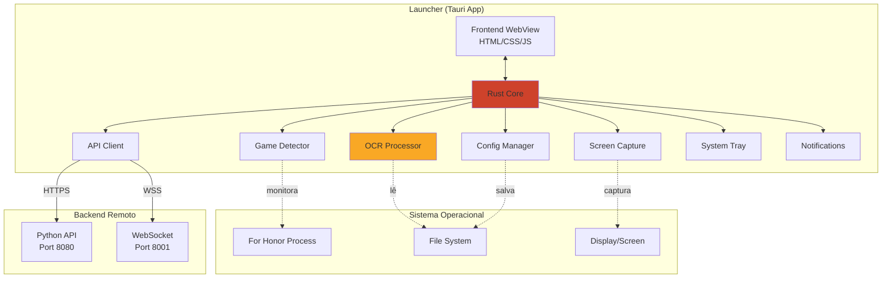

# 🔧 Especificação Técnica do Launcher - RankedHonor

## 📋 Visão Geral Técnica

O Launcher é construído com **Tauri 2.x + Rust**, utilizando OCR local para extrair dados de screenshots da tela de resultados do For Honor, seguindo um modelo **100% opt-in e não-invasivo**.

---

## 🏗️ Arquitetura do Launcher



---

## 🔍 Módulo 1: Game Detector

### Objetivo
Detectar quando For Honor está rodando no sistema operacional.

### Implementação

**Windows:**
```rust
use sysinfo::{System, SystemExt, ProcessExt};

pub struct GameDetector {
    system: System,
    process_names: Vec<String>,
}

impl GameDetector {
    pub fn new() -> Self {
        Self {
            system: System::new_all(),
            process_names: vec![
                "ForHonor.exe".to_string(),
                "ForHonor_Be.exe".to_string(), // BattlEye version
            ],
        }
    }
    
    pub fn is_game_running(&mut self) -> bool {
        self.system.refresh_processes();
        
        for (_, process) in self.system.processes() {
            let name = process.name().to_lowercase();
            if self.process_names.iter().any(|pn| name.contains(&pn.to_lowercase())) {
                return true;
            }
        }
        
        false
    }
    
    pub fn get_game_window_handle(&self) -> Option<WindowHandle> {
        // Platform-specific window detection
        #[cfg(target_os = "windows")]
        {
            use windows::Win32::UI::WindowsAndMessaging::{FindWindowW, GetForegroundWindow};
            // Implementation details...
        }
        
        None
    }
}
```

**Polling Interval:** 2 segundos (baixo overhead)

**Dependências:**
- `sysinfo = "0.30"`
- `windows = "0.52"` (Windows only)

---

## 📸 Módulo 2: Screen Capture

### Objetivo
Capturar screenshot da tela de resultados automaticamente.

### Detecção da Tela de Resultados

**Método: Template Matching**

```rust
use image::{DynamicImage, ImageBuffer, Rgb};
use imageproc::template_matching::{match_template, MatchTemplateMethod};

pub struct ScreenMatcher {
    templates: Vec<DynamicImage>, // Templates para cada idioma
}

impl ScreenMatcher {
    pub fn is_results_screen(&self, screenshot: &DynamicImage) -> (bool, f32) {
        for template in &self.templates {
            let result = match_template(
                &screenshot.to_luma8(),
                &template.to_luma8(),
                MatchTemplateMethod::CrossCorrelationNormalized,
            );
            
            let (max_score, _location) = find_max(&result);
            
            if max_score > 0.85 {
                return (true, max_score);
            }
        }
        
        (false, 0.0)
    }
}
```

**Templates:**
- Logo "Victory" / "Defeat"
- Layout da tela de resultados
- UI elements únicos (botões, scores)

### Captura de Screenshot

```rust
use screenshots::Screen;

pub struct ScreenCapture {
    screen: Screen,
}

impl ScreenCapture {
    pub fn capture_game_window(&self) -> Result<DynamicImage, CaptureError> {
        let screens = Screen::all()?;
        
        // Captura tela principal (ou detecta janela do jogo)
        let screen = &screens[0];
        let image = screen.capture()?;
        
        // Converte para DynamicImage
        let buffer = image.rgba();
        let dynamic_img = DynamicImage::ImageRgba8(
            ImageBuffer::from_raw(
                image.width(),
                image.height(),
                buffer.to_vec(),
            ).ok_or(CaptureError::InvalidBuffer)?
        );
        
        Ok(dynamic_img)
    }
    
    pub fn capture_with_retry(&self, max_attempts: u32) -> Result<DynamicImage, CaptureError> {
        for attempt in 0..max_attempts {
            match self.capture_game_window() {
                Ok(img) => return Ok(img),
                Err(e) if attempt < max_attempts - 1 => {
                    std::thread::sleep(std::time::Duration::from_millis(500));
                    continue;
                },
                Err(e) => return Err(e),
            }
        }
        
        Err(CaptureError::MaxAttemptsReached)
    }
}
```

**Dependências:**
- `screenshots = "0.8"`
- `image = "0.24"`
- `imageproc = "0.23"`

### Otimizações

**Região de Interesse (ROI):**
Ao invés de capturar tela inteira, capturamos apenas região relevante:

```rust
pub fn capture_results_region(&self) -> Result<DynamicImage, CaptureError> {
    let full_screen = self.capture_game_window()?;
    
    // Resultados geralmente ocupam área central-superior
    // Coordenadas para resolução 1920x1080 (ajustar dinamicamente)
    let roi = full_screen.crop_imm(
        320,  // x
        200,  // y
        1280, // width
        600,  // height
    );
    
    Ok(roi)
}
```

**Qualidade Configurável:**
```rust
pub enum CaptureQuality {
    High,   // PNG, sem compressão
    Medium, // JPEG 90%
    Low,    // JPEG 70%
}

pub fn save_screenshot(&self, img: &DynamicImage, quality: CaptureQuality) -> Result<PathBuf, Error> {
    let path = self.get_screenshot_path();
    
    match quality {
        CaptureQuality::High => img.save(&path)?,
        CaptureQuality::Medium => {
            let mut file = File::create(&path)?;
            let encoder = image::codecs::jpeg::JpegEncoder::new_with_quality(&mut file, 90);
            img.write_with_encoder(encoder)?;
        },
        CaptureQuality::Low => {
            let mut file = File::create(&path)?;
            let encoder = image::codecs::jpeg::JpegEncoder::new_with_quality(&mut file, 70);
            img.write_with_encoder(encoder)?;
        },
    }
    
    Ok(path)
}
```

---

## 🔤 Módulo 3: OCR Processor

### Objetivo
Extrair texto do screenshot usando OCR/IA local.

### Opção A: Tesseract OCR

```rust
use tesseract::{Tesseract, PageSegMode};

pub struct OCRProcessor {
    tesseract: Tesseract,
    language: String,
}

impl OCRProcessor {
    pub fn new(language: &str) -> Result<Self, OCRError> {
        let tesseract = Tesseract::new(None, Some(language))?
            .set_page_seg_mode(PageSegMode::PsmAutoOsd)?;
        
        Ok(Self {
            tesseract,
            language: language.to_string(),
        })
    }
    
    pub fn extract_match_data(&self, image_path: &Path) -> Result<MatchData, OCRError> {
        let text = self.tesseract
            .set_image(image_path)?
            .get_text()?;
        
        // Parse o texto extraído
        self.parse_results_screen(&text)
    }
    
    fn parse_results_screen(&self, text: &str) -> Result<MatchData, OCRError> {
        let mut players = Vec::new();
        
        // Regex patterns para extrair informações
        let username_pattern = Regex::new(r"([A-Za-z0-9_-]{3,16})")?;
        let score_pattern = Regex::new(r"(\d+)")?;
        let hero_pattern = Regex::new(r"(Warden|Conqueror|Peacekeeper|...)")?;
        
        // Extração linha por linha
        for line in text.lines() {
            if let Some(player) = self.parse_player_line(line) {
                players.push(player);
            }
        }
        
        Ok(MatchData {
            players,
            mode: self.detect_game_mode(&text)?,
            timestamp: Utc::now(),
            map: self.detect_map(&text),
        })
    }
}
```

**Dependências:**
- `tesseract = "0.13"`
- `regex = "1.10"`

**Idiomas Suportados:**
- `eng` - Inglês
- `por` - Português
- `spa` - Espanhol
- `fra` - Francês
- `deu` - Alemão
- `ita` - Italiano
- `rus` - Russo
- `jpn` - Japonês
- `kor` - Coreano

### Opção B: Modelo ML Customizado (Futuro)

**Vantagens:**
- Maior precisão (98%+ vs 85-90% Tesseract)
- Treinado especificamente para For Honor
- Mais rápido (inferência local via ONNX)

**Stack:**
- Modelo treinado em Python (PyTorch/TensorFlow)
- Exportado para ONNX
- Inferência em Rust via `tract` ou `onnxruntime`

```rust
use tract_onnx::prelude::*;

pub struct MLOCRProcessor {
    model: SimplePlan<TypedFact, Box<dyn TypedOp>, Graph<TypedFact, Box<dyn TypedOp>>>,
}

impl MLOCRProcessor {
    pub fn new(model_path: &Path) -> Result<Self, MLOCRError> {
        let model = tract_onnx::onnx()
            .model_for_path(model_path)?
            .into_optimized()?
            .into_runnable()?;
        
        Ok(Self { model })
    }
    
    pub fn extract_match_data(&self, image: &DynamicImage) -> Result<MatchData, MLOCRError> {
        // Preprocessamento
        let tensor = self.preprocess_image(image)?;
        
        // Inferência
        let result = self.model.run(tvec!(tensor.into()))?;
        
        // Pós-processamento
        self.postprocess_output(result)
    }
}
```

**Dependências:**
- `tract-onnx = "0.21"`

---

## 🌐 Módulo 4: API Client

### Objetivo
Comunicar com o backend para enviar dados e receber atualizações.

### REST API Client

```rust
use reqwest::{Client, StatusCode};
use serde::{Deserialize, Serialize};

#[derive(Serialize)]
pub struct MatchSubmission {
    pub players: Vec<PlayerData>,
    pub mode: GameMode,
    pub map: Option<String>,
    pub timestamp: DateTime<Utc>,
    pub launcher_version: String,
    pub confidence_score: f32,
}

#[derive(Deserialize)]
pub struct MatchSubmissionResponse {
    pub match_id: String,
    pub validated: bool,
    pub validation_sources: u32,
}

pub struct APIClient {
    client: Client,
    base_url: String,
    auth_token: Option<String>,
}

impl APIClient {
    pub fn new(base_url: String) -> Self {
        Self {
            client: Client::builder()
                .timeout(Duration::from_secs(30))
                .build()
                .unwrap(),
            base_url,
            auth_token: None,
        }
    }
    
    pub async fn login(&mut self, email: &str, password: &str) -> Result<LoginResponse, APIError> {
        let response = self.client
            .post(format!("{}/auth/login", self.base_url))
            .json(&serde_json::json!({
                "email": email,
                "password": password,
            }))
            .send()
            .await?;
        
        match response.status() {
            StatusCode::OK => {
                let data: LoginResponse = response.json().await?;
                self.auth_token = Some(data.token.clone());
                Ok(data)
            },
            _ => Err(APIError::LoginFailed),
        }
    }
    
    pub async fn submit_match(&self, submission: MatchSubmission) -> Result<MatchSubmissionResponse, APIError> {
        let token = self.auth_token.as_ref()
            .ok_or(APIError::NotAuthenticated)?;
        
        let response = self.client
            .post(format!("{}/matches/submit", self.base_url))
            .bearer_auth(token)
            .json(&submission)
            .send()
            .await?;
        
        match response.status() {
            StatusCode::CREATED => {
                let data = response.json().await?;
                Ok(data)
            },
            StatusCode::UNAUTHORIZED => Err(APIError::TokenExpired),
            _ => Err(APIError::SubmissionFailed),
        }
    }
    
    pub async fn refresh_token(&mut self, refresh_token: &str) -> Result<String, APIError> {
        let response = self.client
            .post(format!("{}/auth/refresh", self.base_url))
            .json(&serde_json::json!({
                "refresh_token": refresh_token,
            }))
            .send()
            .await?;
        
        let data: RefreshResponse = response.json().await?;
        self.auth_token = Some(data.token.clone());
        
        Ok(data.token)
    }
}
```

**Dependências:**
- `reqwest = { version = "0.11", features = ["json"] }`
- `serde = { version = "1.0", features = ["derive"] }`
- `serde_json = "1.0"`

### WebSocket Client (Real-time)

```rust
use tokio_tungstenite::{connect_async, tungstenite::Message};
use futures_util::{StreamExt, SinkExt};

pub struct WebSocketClient {
    url: String,
    auth_token: String,
}

impl WebSocketClient {
    pub async fn connect(&self) -> Result<WebSocketConnection, WSError> {
        let (ws_stream, _) = connect_async(&self.url).await?;
        
        // Autenticação
        let (mut write, mut read) = ws_stream.split();
        write.send(Message::Text(serde_json::json!({
            "type": "auth",
            "token": self.auth_token,
        }).to_string())).await?;
        
        // Aguarda confirmação
        if let Some(Ok(Message::Text(msg))) = read.next().await {
            let response: AuthResponse = serde_json::from_str(&msg)?;
            if !response.success {
                return Err(WSError::AuthFailed);
            }
        }
        
        Ok(WebSocketConnection {
            write,
            read,
        })
    }
    
    pub async fn subscribe_to_match_updates(&self, conn: &mut WebSocketConnection) -> Result<(), WSError> {
        conn.write.send(Message::Text(serde_json::json!({
            "type": "subscribe",
            "channel": "match_updates",
        }).to_string())).await?;
        
        Ok(())
    }
}
```

**Dependências:**
- `tokio-tungstenite = "0.21"`
- `futures-util = "0.3"`

---

## ⚙️ Módulo 5: Config Manager

### Objetivo
Gerenciar configurações do usuário persistidas localmente.

### Estrutura de Configuração

```rust
use serde::{Deserialize, Serialize};
use std::path::PathBuf;

#[derive(Serialize, Deserialize, Clone)]
pub struct LauncherConfig {
    // Autenticação
    pub auth_token: Option<String>,
    pub refresh_token: Option<String>,
    pub user_id: Option<String>,
    pub username: Option<String>,
    
    // Vinculação do jogo
    pub ubisoft_username: Option<String>,
    pub forhonor_username: Option<String>,
    
    // Configurações de captura
    pub capture_quality: CaptureQuality,
    pub ocr_language: String,
    pub polling_interval_ms: u64,
    
    // UI
    pub auto_start: bool,
    pub minimize_to_tray: bool,
    pub show_notifications: bool,
    pub notification_sound: bool,
    
    // Privacidade
    pub pause_collection: bool,
    pub save_screenshots_locally: bool,
    
    // Avançado
    pub api_base_url: String,
    pub ws_base_url: String,
    pub log_level: String,
}

impl Default for LauncherConfig {
    fn default() -> Self {
        Self {
            auth_token: None,
            refresh_token: None,
            user_id: None,
            username: None,
            ubisoft_username: None,
            forhonor_username: None,
            capture_quality: CaptureQuality::High,
            ocr_language: "eng".to_string(),
            polling_interval_ms: 2000,
            auto_start: false,
            minimize_to_tray: true,
            show_notifications: true,
            notification_sound: false,
            pause_collection: false,
            save_screenshots_locally: false,
            api_base_url: "https://api.rankedhonor.gg".to_string(),
            ws_base_url: "wss://ws.rankedhonor.gg".to_string(),
            log_level: "info".to_string(),
        }
    }
}

pub struct ConfigManager {
    config_path: PathBuf,
    config: LauncherConfig,
}

impl ConfigManager {
    pub fn new() -> Result<Self, ConfigError> {
        let config_path = Self::get_config_path()?;
        let config = Self::load_config(&config_path)?;
        
        Ok(Self {
            config_path,
            config,
        })
    }
    
    fn get_config_path() -> Result<PathBuf, ConfigError> {
        let config_dir = dirs::config_dir()
            .ok_or(ConfigError::NoConfigDir)?
            .join("rankedhonor");
        
        std::fs::create_dir_all(&config_dir)?;
        
        Ok(config_dir.join("config.json"))
    }
    
    fn load_config(path: &Path) -> Result<LauncherConfig, ConfigError> {
        if path.exists() {
            let contents = std::fs::read_to_string(path)?;
            let config = serde_json::from_str(&contents)?;
            Ok(config)
        } else {
            Ok(LauncherConfig::default())
        }
    }
    
    pub fn save(&self) -> Result<(), ConfigError> {
        let json = serde_json::to_string_pretty(&self.config)?;
        std::fs::write(&self.config_path, json)?;
        Ok(())
    }
    
    pub fn get(&self) -> &LauncherConfig {
        &self.config
    }
    
    pub fn update<F>(&mut self, updater: F) -> Result<(), ConfigError>
    where
        F: FnOnce(&mut LauncherConfig),
    {
        updater(&mut self.config);
        self.save()
    }
}
```

**Localização do arquivo:**
- **Windows:** `C:\Users\<user>\AppData\Roaming\rankedhonor\config.json`
- **macOS:** `/Users/<user>/Library/Application Support/rankedhonor/config.json`
- **Linux:** `/home/<user>/.config/rankedhonor/config.json`

**Dependências:**
- `dirs = "5.0"`

---

## 🔔 Módulo 6: Notifications

### Objetivo
Notificar o usuário de eventos importantes.

```rust
use notify_rust::{Notification, Timeout};

pub struct NotificationManager {
    enabled: bool,
    sound_enabled: bool,
}

impl NotificationManager {
    pub fn new(enabled: bool, sound_enabled: bool) -> Self {
        Self {
            enabled,
            sound_enabled,
        }
    }
    
    pub fn notify_match_submitted(&self, match_id: &str, validated: bool) {
        if !self.enabled {
            return;
        }
        
        let title = "Partida Registrada!";
        let body = if validated {
            format!("Partida {} validada com sucesso ✓", match_id)
        } else {
            format!("Partida {} enviada (aguardando validação)", match_id)
        };
        
        Notification::new()
            .summary(title)
            .body(&body)
            .icon("rankedhonor")
            .timeout(Timeout::Milliseconds(5000))
            .show()
            .ok();
        
        if self.sound_enabled {
            // Play notification sound
            // rodio or similar library
        }
    }
    
    pub fn notify_error(&self, error_msg: &str) {
        if !self.enabled {
            return;
        }
        
        Notification::new()
            .summary("Erro no RankedHonor")
            .body(error_msg)
            .icon("rankedhonor-error")
            .timeout(Timeout::Milliseconds(8000))
            .show()
            .ok();
    }
    
    pub fn notify_game_detected(&self) {
        if !self.enabled {
            return;
        }
        
        Notification::new()
            .summary("For Honor Detectado")
            .body("O launcher está monitorando suas partidas")
            .icon("rankedhonor")
            .timeout(Timeout::Milliseconds(3000))
            .show()
            .ok();
    }
}
```

**Dependências:**
- `notify-rust = "4.10"`

---

## 🔄 Loop Principal

### Fluxo de Execução

```rust
pub struct LauncherCore {
    game_detector: GameDetector,
    screen_capture: ScreenCapture,
    screen_matcher: ScreenMatcher,
    ocr_processor: OCRProcessor,
    api_client: APIClient,
    config_manager: ConfigManager,
    notification_manager: NotificationManager,
    is_running: Arc<AtomicBool>,
}

impl LauncherCore {
    pub async fn run(&mut self) -> Result<(), LauncherError> {
        let config = self.config_manager.get().clone();
        let polling_interval = Duration::from_millis(config.polling_interval_ms);
        
        let mut game_was_running = false;
        let mut last_match_timestamp: Option<DateTime<Utc>> = None;
        
        while self.is_running.load(Ordering::SeqCst) {
            // 1. Verificar se o jogo está rodando
            let game_running = self.game_detector.is_game_running();
            
            if game_running && !game_was_running {
                // Jogo acabou de iniciar
                self.notification_manager.notify_game_detected();
                game_was_running = true;
            } else if !game_running && game_was_running {
                // Jogo foi fechado
                game_was_running = false;
            }
            
            // 2. Se o jogo está rodando, monitorar tela de resultados
            if game_running {
                match self.screen_capture.capture_game_window() {
                    Ok(screenshot) => {
                        let (is_results, confidence) = self.screen_matcher.is_results_screen(&screenshot);
                        
                        if is_results && confidence > 0.85 {
                            // Evitar duplicatas (mesma partida capturada múltiplas vezes)
                            let now = Utc::now();
                            if let Some(last_ts) = last_match_timestamp {
                                if now.signed_duration_since(last_ts).num_seconds() < 30 {
                                    tokio::time::sleep(polling_interval).await;
                                    continue;
                                }
                            }
                            
                            // Processar partida
                            self.process_match(screenshot, confidence).await?;
                            last_match_timestamp = Some(now);
                        }
                    },
                    Err(e) => {
                        tracing::warn!("Falha ao capturar tela: {}", e);
                    }
                }
            }
            
            // 3. Aguardar próximo ciclo
            tokio::time::sleep(polling_interval).await;
        }
        
        Ok(())
    }
    
    async fn process_match(&mut self, screenshot: DynamicImage, confidence: f32) -> Result<(), LauncherError> {
        tracing::info!("Tela de resultados detectada (confidence: {:.2})", confidence);
        
        // Salvar screenshot se configurado
        let config = self.config_manager.get();
        let screenshot_path = if config.save_screenshots_locally {
            Some(self.save_screenshot(&screenshot, config.capture_quality)?)
        } else {
            None
        };
        
        // Processar OCR
        let match_data = self.ocr_processor.extract_match_data(
            screenshot_path.as_ref().unwrap_or(&PathBuf::from("temp.png"))
        )?;
        
        // Enviar ao backend
        let submission = MatchSubmission {
            players: match_data.players,
            mode: match_data.mode,
            map: match_data.map,
            timestamp: match_data.timestamp,
            launcher_version: env!("CARGO_PKG_VERSION").to_string(),
            confidence_score: confidence,
        };
        
        match self.api_client.submit_match(submission).await {
            Ok(response) => {
                tracing::info!("Partida {} enviada com sucesso", response.match_id);
                self.notification_manager.notify_match_submitted(&response.match_id, response.validated);
            },
            Err(APIError::TokenExpired) => {
                // Tentar refresh
                tracing::warn!("Token expirado, tentando refresh...");
                // Auto-refresh logic
            },
            Err(e) => {
                tracing::error!("Falha ao enviar partida: {}", e);
                self.notification_manager.notify_error(&format!("Falha ao enviar dados: {}", e));
            }
        }
        
        Ok(())
    }
}
```

---

## 🎨 Frontend (WebView)

### Interface Minimalista

**HTML/CSS/JS simples:**

```html
<!-- src/index.html -->
<!DOCTYPE html>
<html>
<head>
    <title>RankedHonor Launcher</title>
    <link rel="stylesheet" href="styles.css">
</head>
<body>
    <div id="app">
        <div class="header">
            
            <h1>RankedHonor Launcher</h1>
        </div>
        
        <div id="login-view" class="view">
            <input id="email" type="email" placeholder="Email">
            <input id="password" type="password" placeholder="Senha">
            <button id="login-btn">Entrar</button>
        </div>
        
        <div id="main-view" class="view hidden">
            <div class="status">
                <span id="status-text">Aguardando For Honor...</span>
                <div class="indicator" id="status-indicator"></div>
            </div>
            
            <div class="stats">
                <p>Partidas enviadas hoje: <strong id="matches-today">0</strong></p>
                <p>Última partida: <strong id="last-match">-</strong></p>
            </div>
            
            <button id="settings-btn">Configurações</button>
            <button id="logout-btn">Sair</button>
        </div>
    </div>
    
    <script src="main.js"></script>
</body>
</html>
```

**Comunicação Tauri:**

```javascript
// src/main.js
const { invoke } = window.__TAURI__.tauri;

async function login() {
    const email = document.getElementById('email').value;
    const password = document.getElementById('password').value;
    
    try {
        await invoke('login', { email, password });
        showMainView();
    } catch (error) {
        alert('Erro ao fazer login: ' + error);
    }
}

async function getStatus() {
    const status = await invoke('get_launcher_status');
    updateUI(status);
}

// Atualizar UI a cada 2 segundos
setInterval(getStatus, 2000);
```

**Backend Tauri (commands):**

```rust
#[tauri::command]
async fn login(email: String, password: String) -> Result<(), String> {
    let mut app_state = APP_STATE.lock().await;
    app_state.api_client.login(&email, &password)
        .await
        .map_err(|e| e.to_string())?;
    Ok(())
}

#[tauri::command]
async fn get_launcher_status() -> Result<LauncherStatus, String> {
    let app_state = APP_STATE.lock().await;
    Ok(LauncherStatus {
        game_running: app_state.game_detector.is_game_running(),
        matches_today: app_state.stats.matches_today,
        last_match: app_state.stats.last_match_time,
    })
}
```

---

## 📦 Build e Distribuição

### Configuração Tauri

```json
// src-tauri/tauri.conf.json
{
  "build": {
    "beforeDevCommand": "",
    "beforeBuildCommand": "",
    "devPath": "../src",
    "distDir": "../src"
  },
  "package": {
    "productName": "RankedHonor",
    "version": "0.1.0"
  },
  "tauri": {
    "allowlist": {
      "all": false,
      "shell": {
        "all": false,
        "open": true
      },
      "window": {
        "all": false,
        "close": true,
        "hide": true,
        "show": true,
        "minimize": true,
        "startDragging": true
      },
      "notification": {
        "all": true
      }
    },
    "bundle": {
      "active": true,
      "targets": ["msi", "deb", "dmg"],
      "identifier": "gg.rankedhonor.launcher",
      "icon": [
        "icons/32x32.png",
        "icons/128x128.png",
        "icons/icon.icns",
        "icons/icon.ico"
      ]
    },
    "security": {
      "csp": "default-src 'self'; connect-src https://api.rankedhonor.gg wss://ws.rankedhonor.gg"
    },
    "updater": {
      "active": true,
      "endpoints": [
        "https://releases.rankedhonor.gg/{{target}}/{{current_version}}"
      ],
      "dialog": true,
      "pubkey": "YOUR_PUBLIC_KEY"
    },
    "windows": [
      {
        "title": "RankedHonor",
        "width": 400,
        "height": 600,
        "resizable": false,
        "fullscreen": false,
        "decorations": true
      }
    ],
    "systemTray": {
      "iconPath": "icons/tray-icon.png",
      "menuOnLeftClick": false
    }
  }
}
```

### Build Commands

```bash
# Development
cargo tauri dev

# Production build
cargo tauri build --release

# Build para múltiplas plataformas
cargo tauri build --target x86_64-pc-windows-msvc
cargo tauri build --target x86_64-apple-darwin
cargo tauri build --target x86_64-unknown-linux-gnu
```

### Instaladores Gerados

- **Windows:** `.msi` installer
- **macOS:** `.dmg` image
- **Linux:** `.deb` package (Ubuntu/Debian), `.AppImage`

---

## 🔐 Segurança e Privacidade

### Armazenamento Seguro de Tokens

```rust
use keyring::Entry;

pub struct SecureStorage {
    entry: Entry,
}

impl SecureStorage {
    pub fn new() -> Result<Self, KeyringError> {
        let entry = Entry::new("rankedhonor", "auth_tokens")?;
        Ok(Self { entry })
    }
    
    pub fn store_tokens(&self, auth_token: &str, refresh_token: &str) -> Result<(), KeyringError> {
        let data = serde_json::json!({
            "auth": auth_token,
            "refresh": refresh_token,
        });
        self.entry.set_password(&data.to_string())?;
        Ok(())
    }
    
    pub fn get_tokens(&self) -> Result<(String, String), KeyringError> {
        let data = self.entry.get_password()?;
        let json: serde_json::Value = serde_json::from_str(&data)?;
        Ok((
            json["auth"].as_str().unwrap().to_string(),
            json["refresh"].as_str().unwrap().to_string(),
        ))
    }
    
    pub fn delete_tokens(&self) -> Result<(), KeyringError> {
        self.entry.delete_password()?;
        Ok(())
    }
}
```

**Dependências:**
- `keyring = "2.3"`

**Backends:**
- **Windows:** Windows Credential Manager
- **macOS:** Keychain
- **Linux:** Secret Service API (gnome-keyring, kwallet)

### Proteção de Dados

1. **Tokens nunca em plaintext** no filesystem
2. **HTTPS obrigatório** para comunicação
3. **Sem coleta de dados sensíveis** (apenas gameplay)
4. **Screenshots temporários** deletados após processamento (se configurado)
5. **Logs anonimizados** (sem usernames/IPs)

---

## 📊 Logging e Telemetria

```rust
use tracing::{info, warn, error, debug};
use tracing_subscriber::{fmt, EnvFilter};

pub fn init_logging(config: &LauncherConfig) {
    let log_level = &config.log_level;
    
    tracing_subscriber::fmt()
        .with_env_filter(EnvFilter::new(log_level))
        .with_target(false)
        .with_file(true)
        .with_line_number(true)
        .with_writer(get_log_file())
        .init();
    
    info!("Launcher iniciado - versão {}", env!("CARGO_PKG_VERSION"));
}

fn get_log_file() -> File {
    let log_dir = dirs::data_local_dir()
        .unwrap()
        .join("rankedhonor")
        .join("logs");
    
    std::fs::create_dir_all(&log_dir).unwrap();
    
    let log_file = log_dir.join(format!(
        "launcher_{}.log",
        chrono::Local::now().format("%Y%m%d")
    ));
    
    File::create(log_file).unwrap()
}
```

**Logs localizados em:**
- **Windows:** `C:\Users\<user>\AppData\Local\rankedhonor\logs\`
- **macOS:** `/Users/<user>/Library/Logs/rankedhonor/`
- **Linux:** `/home/<user>/.local/share/rankedhonor/logs/`

**Dependências:**
- `tracing = "0.1"`
- `tracing-subscriber = "0.3"`

---

## 🧪 Testes

### Unit Tests

```rust
#[cfg(test)]
mod tests {
    use super::*;
    
    #[test]
    fn test_game_detector() {
        let mut detector = GameDetector::new();
        // Mock test - verificar se detecta processo fake
        assert!(!detector.is_game_running());
    }
    
    #[tokio::test]
    async fn test_api_client_login() {
        let mut client = APIClient::new("http://localhost:8080".to_string());
        let result = client.login("test@example.com", "password123").await;
        // Asserções...
    }
    
    #[test]
    fn test_ocr_parser() {
        let processor = OCRProcessor::new("eng").unwrap();
        let mock_text = "Player1 Warden 15\nPlayer2 Conqueror 8";
        let result = processor.parse_results_screen(mock_text);
        assert!(result.is_ok());
        assert_eq!(result.unwrap().players.len(), 2);
    }
}
```

### Integration Tests

```rust
// tests/integration_test.rs
#[tokio::test]
async fn test_full_match_submission_flow() {
    // Setup
    let launcher = LauncherCore::new_for_testing().await;
    
    // Simulate screenshot
    let screenshot = image::open("test_data/sample_results_screen.png").unwrap();
    
    // Process
    let result = launcher.process_match(screenshot, 0.95).await;
    
    // Assert
    assert!(result.is_ok());
}
```

---

## 📈 Performance

### Benchmarks Alvo

| Operação | Target | Atual |
|----------|--------|-------|
| Game detection check | <10ms | TBD |
| Screenshot capture | <100ms | TBD |
| Template matching | <50ms | TBD |
| OCR processing | <2s | TBD |
| API submission | <500ms | TBD |
| **Total (match to submit)** | **<3s** | **TBD** |

### Otimizações

1. **Polling adaptativo:** Aumentar intervalo quando jogo não está rodando
2. **ROI em vez de fullscreen:** Capturar apenas região relevante
3. **Caching de templates:** Carregar uma vez na inicialização
4. **Async/await:** Não bloquear UI durante processamento
5. **Connection pooling:** Reutilizar conexões HTTP

---

## 🚀 Próximos Passos

### MVP (v0.1.0)
- [ ] Implementar Game Detector
- [ ] Implementar Screen Capture
- [ ] Integrar Tesseract OCR básico
- [ ] Implementar API Client
- [ ] UI mínima (login + status)
- [ ] System tray icon

### v0.2.0
- [ ] Melhorar precisão OCR (treinamento customizado)
- [ ] Multi-idioma completo
- [ ] Auto-update funcional
- [ ] Logging estruturado
- [ ] Testes de integração

### v1.0.0
- [ ] ML model para OCR (98%+ accuracy)
- [ ] Dashboard embutido no launcher
- [ ] Performance otimizada (<3s total)
- [ ] Cross-platform testado e estável

---

**Última atualização:** Janeiro 2026  
**Versão do documento:** 1.0  
**Status:** 📋 Especificação completa - Implementação pendente
